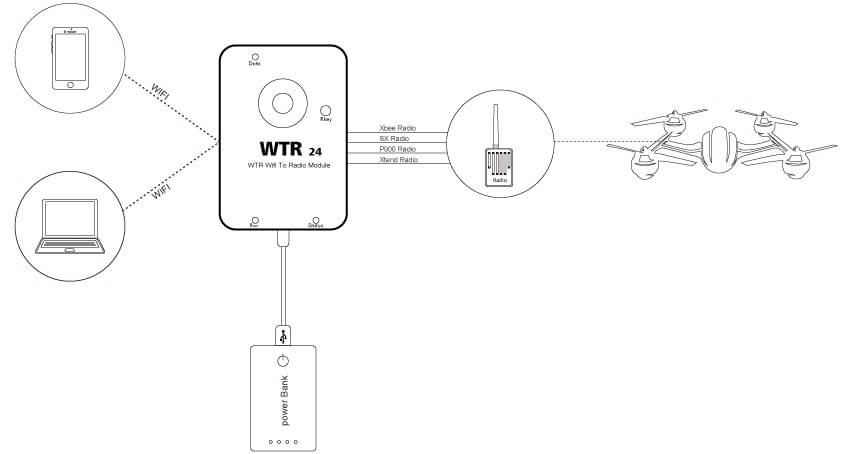

### System Framework Diagram

###CUAV P900 connection use

The aircraft is connected to the flight controller according to the normal connection of the P900; the ground end is connected to the P900 cable through the official cuav wtr link.

Supply voltage: 5v+-0.25v

Supply current: more than 1A

---

### CUAV S3B connection use

The aircraft is connected to the flight controller in accordance with the P900 normal connection; the ground end is connected to the xbee cable via the official cuav wtr link.

Supply voltage: 5v+-0.25v

Supply current: more than 1A

---

### CUAV XTEND connection use

The aircraft is connected to the flight controller according to the normal connection of the P900; the ground end is connected to the xteng cable through the official craav link made by cuav.

Supply voltage: 5v+-0.25v

Supply current: more than 1A

---

---