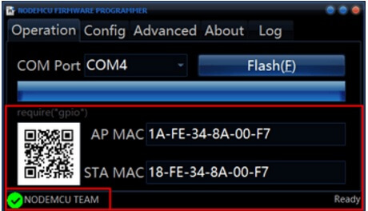

## 更新程序说明

目前对于 wtr-Link 模块并没有提供在线更新程序，需要用户手动更新程序。需要下载[烧录软件](http://fw.cuav.net/pc/ESP8266Flasher.rar)和[最新版程序包](http://fw.cuav.net/pc/wtrlink.rar)并解压文件包。具体的烧录步骤如下：

1.行烧录软件ESP8266Flasher.exe，点击**Advanced**选项，修改对应选项如图；

2.点击**Config**选项，点击右边三角符号把文件名称改为如下图，看绿色字体区域，点击该区域三角图标

找到右边名称相同的文件，点击打开就设置好了文件路径。

>**右边白色字体的文件名称改成绿色区域的文件名**

3.点击**Operation**选项，使用**烧录线**将 TTL 板与 电脑usb相连（可自制烧录线，看ttl小板及wtr\_link背后标识，将gnd、5v对应接上，rx、tx交叉接）选择对应的端口\(端口可在我的电脑》设备管理器》端口处查看），按住数传模块recovery按键并给模块上电，点击**Flash**按钮;

4.烧录成功提示图如下（烧录成功模块D2 led会闪\)

>**NOTE**目前最新版本为：2.1.0，支持模块正常运行后，IO0短接GND超过5S即恢复网络默认配置的功能，蓝灯常亮或者熄灭表示恢复完成。切记不要同时短接和上电，这样是进入烧录程序模式。

