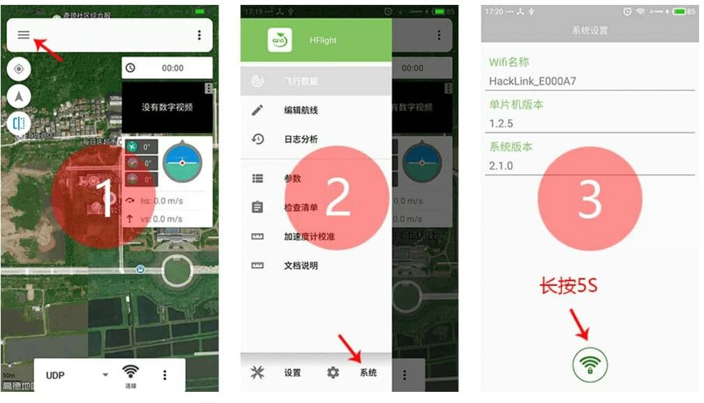
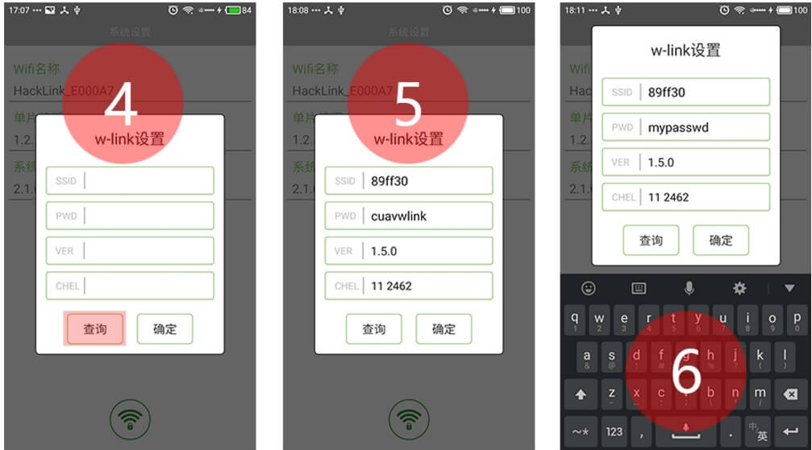

# 软件使用说明 {#软件使用说明}

### HFlight 连接方式 {#hflight-连接方式}

---

**HFlight**安卓手机地面站是**雷迅（CUAV）**官方推广的手机地面站，完美地兼容本公司所有产品，欢迎广大模友下载使用。软件下载链接：[HFlight](http://fw.cuav.net/apk/HFlight.apk)。

对于PW-Link无线数传模块，HFlight获取和显示飞控信息的步骤如下：

1. 确认PW-Link与Pix飞控已经连接正常；

2. 手机搜索WiFi 网络，连接名称为：**CUAVWTR\_XXXXXX**的网络,默认密码:cuavwtr666.

3. 打开HFlight手机软件，选择**UDP**连接方式，操作如图；

4.确认UDP服务器通信端口，检查端口是否为**14550**；

5.最后点击**连接**按钮，成功获取飞控信息后，数据界面会显示出来；

### HFIight修改配置

---

HFlight提供了修改PW-Link网络配置的窗口，允许修改网络的**名称**、**密码**、**信道**和**获取版本信息**。具体的操作方式是，首先打开 HFlight 手机软件的侧边栏菜单，点击系统按钮，进入到系统设置界面，长按网络设置图标即可。操作如图所示：

PW-Link 

配置窗口的具体操作步骤是，首先点击查询按钮获取 PW-Link 模块的网络信息，获取成功后，修改对应的选项即可。操作如图所示：

### Mission Planner 连接方式

---

电脑端的地面站软件以 Mission Planner 进行操作说明。具体步骤如下：

1. 电脑使用无线网卡连接网络**CUAVWlink\_XXXXXX**，密码**cuavwlink**；

2. 打开 Mission Planner 软件，选择右上角选项**UDP**方式，点击连接按钮；

3. 最后，在弹出的端口编辑栏输入**14550**，点击确认；

4. 等待数据接收完成；

> **NOTE** 有部分用户反映，电脑已经连接上了 PW-Link 网络，但是 Mission Planner 无法接收到数据。出现这个问题的原因是因为你禁用了网络权限导致的。
>
> 解决办法：打开**控制面板**&gt;**Windows 防火墙**&gt;**允许应用通过防火墙进行通信**&gt;**打开 MP 全部网络权限**。

